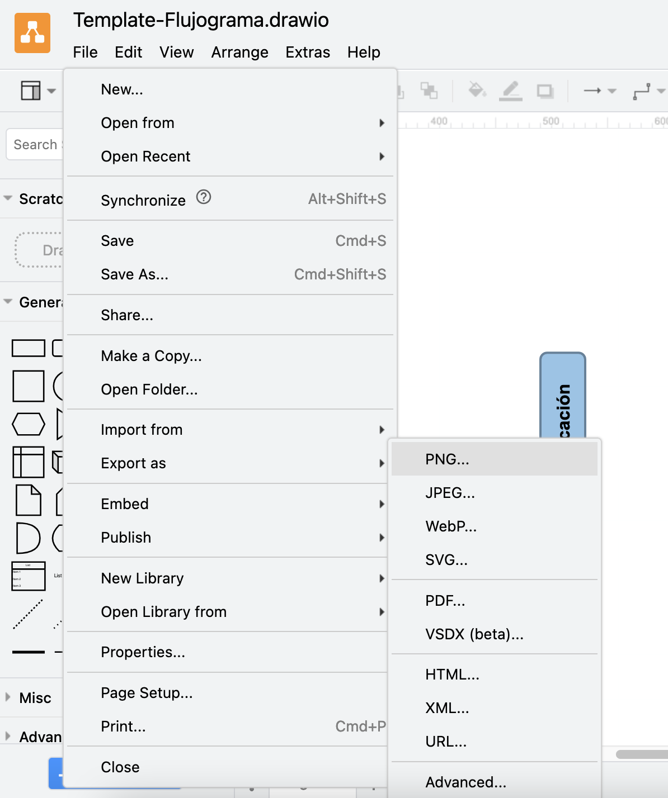
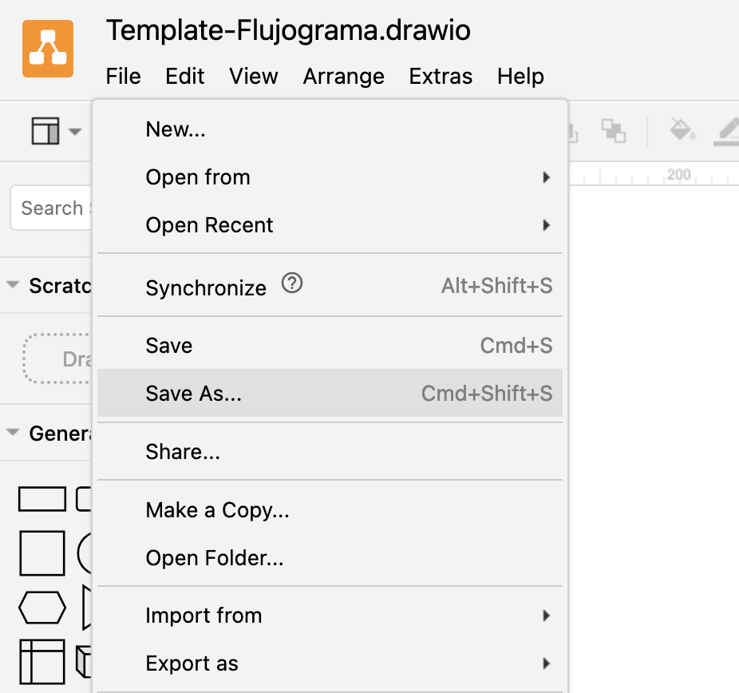

# Flujograma PRISMA | Revisión Sistemática de la Literatura

Este repositorio contiene un modelo de flujograma PRISMA desarrollado en [_draw.io_](https://app.diagrams.net/), utilizado para una revisión sistemática de la literatura.

---

## 🔎 Vista Previa

<!-- Temporalmente se utiliza 

 en lugar de 

 para el centrado de las imágenes en este documento. -->

    

---

# 📝 Como Editar el Flujograma (paso a paso)

A continuación se mostrará un breve paso a paso de como editar el archivo de flujograma utilizando **draw.io**.

**Nota:** Para llevar a cabo la edición de este flujograma y seguir el procedimiento detallado en este documento, se recomienda el uso de un ordenador, ya que no se incluye un paso a paso de edición desde un celular o dispositivo móvil.  

 

> **Cabe destacar que el flujograma ha sido diseñado específicamente para ser editado en la plataforma [draw.io](https://app.diagrams.net/).**

## 1. Descargue este Repositorio

**1.1.** Ingrese al repositorio en GitHub:

> https://github.com/aretesatori/flujograma-revision-sistematica

**1.2.** Haga clic en el botón "Code" de color verde, ubicado en la parte superior de la página del repositorio. Tal como se muestra en la imagen a continuación:  

    

**1.3.** Haga clic en "Download ZIP".  

    

**1.4.** Luego de eso, debería ser descargado un archivo comprimido llamado `flujograma-revision-sistematica-main.zip` con todo el contenido de este repositorio, incluyendo este documento con las instrucciones.

    

**1.5.** Una vez descargado el repositorio, descomprima `flujograma-revision-sistematica-main.zip` e identifique el archivo `Template-Flujograma.drawio`. **Ese archivo corresponde al editable del flujograma**.

    

## 2. Ingrese a **draw.io**

**2.1.** Una vez tenga el archivo del paso anterior, ingrese a la página de **draw.io**:  

> https://app.diagrams.net/

**2.2.** Al abrir la página, si le aparece la siguiente opción, elija donde desea guardar el flujograma después de ser editado. Por defecto, seleccione "Device" para que sea guardado en el dipositivo.

    

## 3. Suba el archivo descargado

**3.1.** Luego del paso anterior, debería aparecer una ventana como la que se muestra en la imagen a continuación:

    

**3.2.** Si le aparecen esas opciones, haga clic en la segunda opción "**Open Existing Diagram**". Enseguida debería mostrarse una ventana emergente en su navegador que permitirá buscar y abrir el archivo editable desde su computador. Ingrese al directorio del repositorio descargado (`flujograma-revision-sistematica-main.zip` que fue descomprimido) y seleccione el archivo `Template-Flujograma.drawio`.

## 4. Visualice y Edite el Flujograma

**4.1.** Si no hubo problemas hasta el paso anterior, inmediatamente después de seleccionar y subir el archivo señalado debería verse el diagrama, tal como se muestra a continuación:

    

**4.2.** La interfaz de **draw.io** es relativamente intuitiva, de manera que cualquier usuario puede utilizar y editar diagramas sin nunca haber utilizado esa plataforma. Asimismo, a continuación se mostrará brevemente cómo editar la información contenida en el flujograma.

**4.2.1.** 

> Para este flujograma, dentro de cada rectángulo blanco se utiliza **fuente Helvetica**, letra **tamaño 16 px**, centrado horizontal, color negro (hexadecimal **#000**). 

## 5. Guardar o Exportar el Flujograma

**5.1.** Para guardar el diagrama en **formato de imagen**, dentro de la interfaz de **draw.io** diríjase a "File", "Export as", y seleccione el formato en el que desea guardar.  

    

De forma general, se recomienda guardar los diagramas en formato **PNG** (_Portable Network Graphics_) para una menor pérdida de calidad.

**5.2.** Para guardar el diagrama como un **archivo editable**, dentro de la interfaz de **draw.io** diríjase a "File" y haga clic en "Save As", tal como se muestra a continuación:

    

Seleccione el nombre del archivo, donde desea guardarlo, y finalmente haga clic en el botón "OK".

---

## 🌐 Referencias

> **Flowchart Maker & Online Diagram Software** (https://app.diagrams.net/)

> **Use the draw.io editor** (https://www.drawio.com/doc/getting-started-editor)

> **Open an existing diagram file** (https://www.drawio.com/doc/faq/open-diagram-file)

---

# 💬 Contacto

Cualquier sugerencia, contribución y/o comentario es bienvenido.

* Correo electrónico: arete.poffart@alumnos.uach.cl