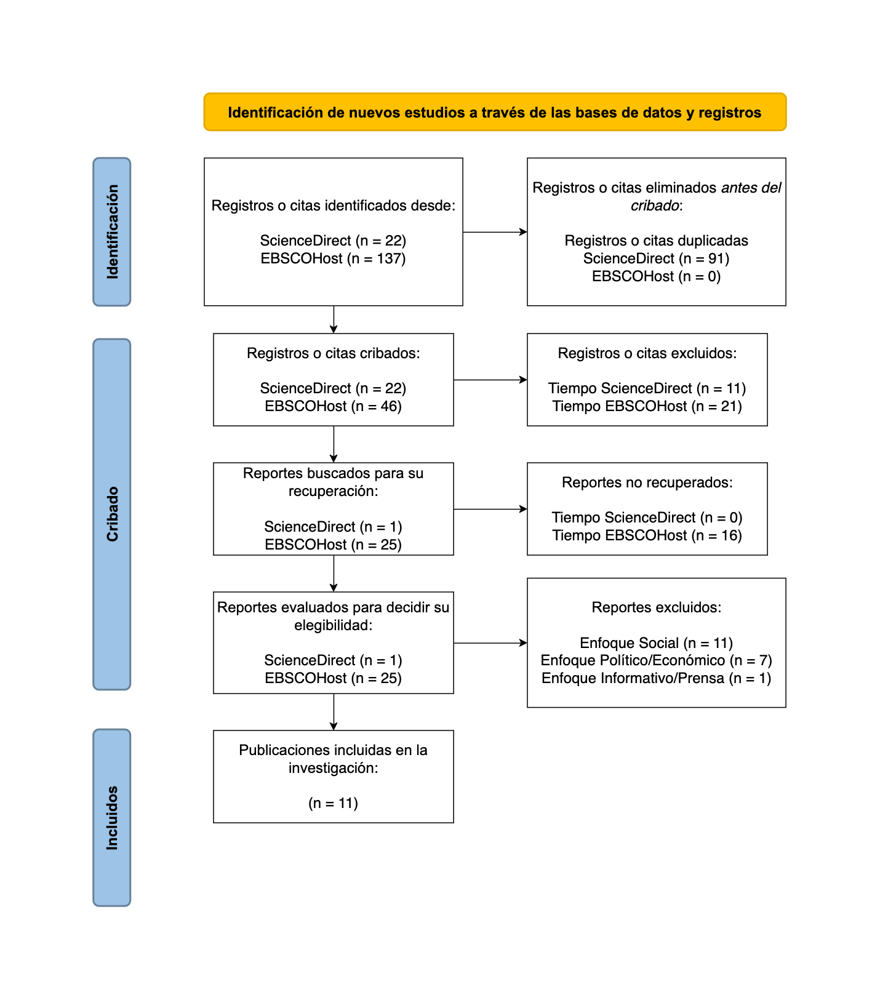
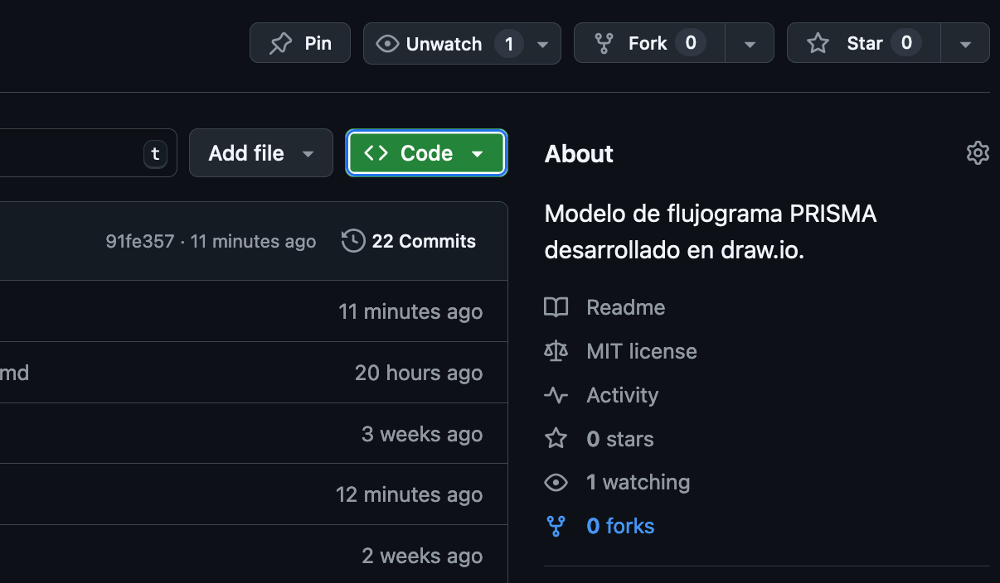
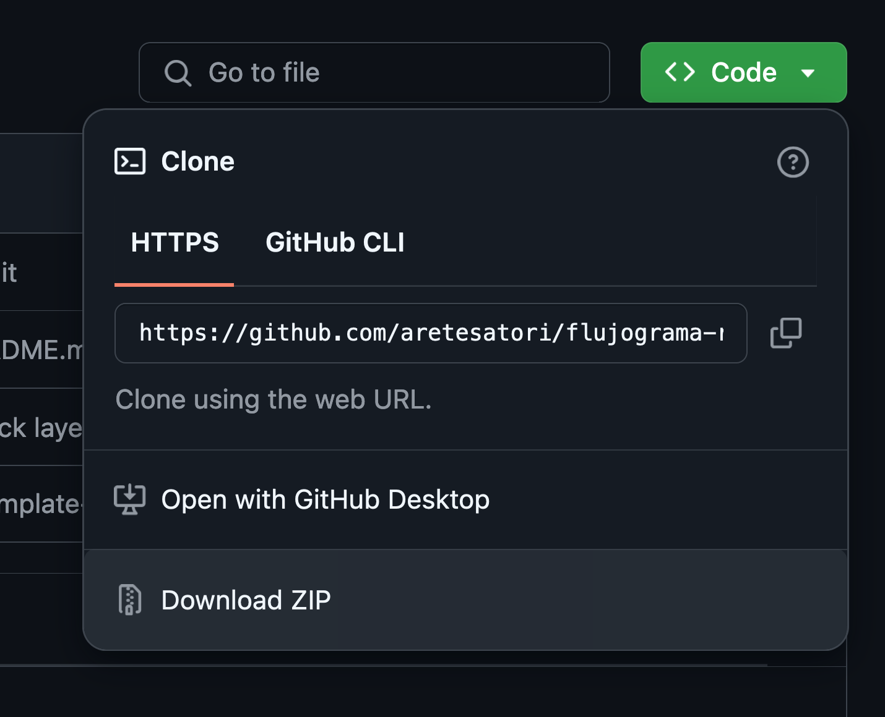
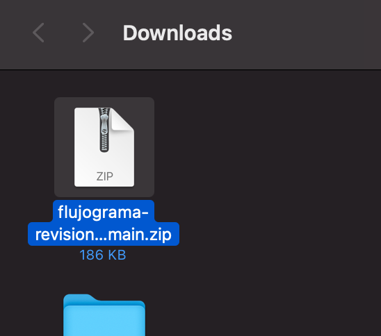
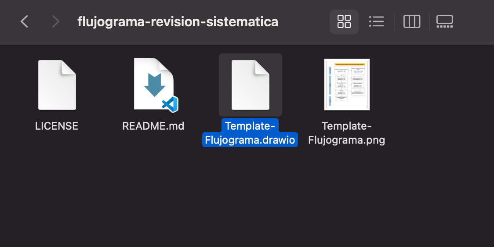
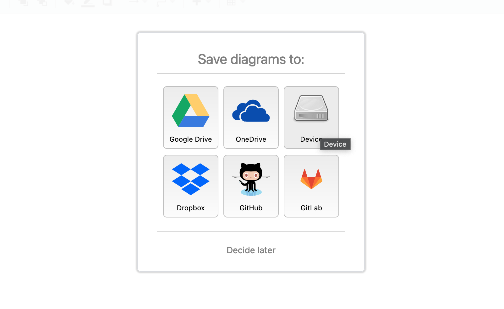
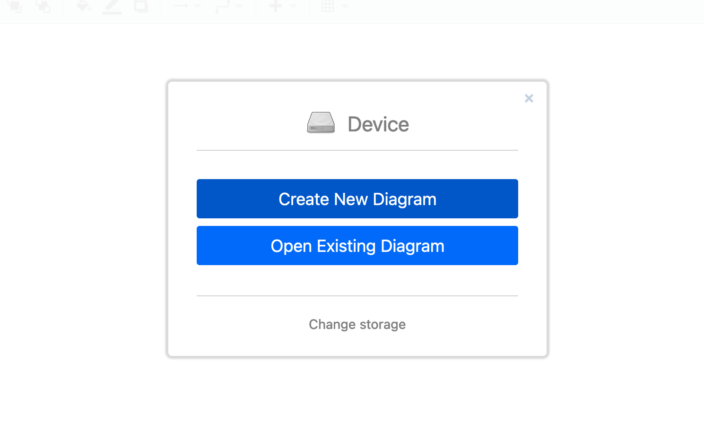
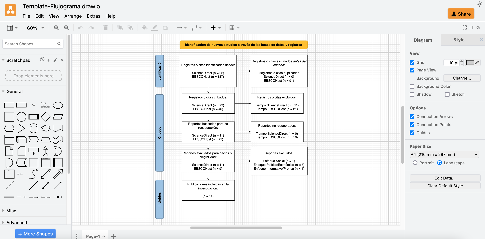

# Flujograma | Revisión Sistemática de la Literatura

Modelo de flujograma para revisión sistemática de la literatura, desarrollado en [_draw.io_](https://app.diagrams.net/).

# Vista Previa

---

# Como editar el flujograma (Paso a paso)

A continuación se mostrará un breve paso a paso de como editar el archivo de flujograma utilizando _draw.io_.

**Nota:** 

## 1. Descargue este repositorio

**1.1.** Ingrese al repositorio en GitHub:

> https://github.com/aretesatori/flujograma-revision-sistematica

**1.2.** Haga clic en el botón "Code" de color verde, ubicado en la parte superior de la página del repositorio. Tal como se muestra en la imagen a continuación:  

**1.3.** Haga clic en "Download ZIP".  

**1.4.** Luego de eso, debería ser descargado un archivo llamado `flujograma-revision-sistematica-main.zip`.

**1.5.** Una vez descargado el archivo comprimido, descomprímelo e identifique el archivo `Template-Flujograma.drawio`. Ese archivo corresponde al archivo editable del flujograma.

## 2. Ingrese a draw.io

**2.1.** Una vez tenga el archivo del paso anterior, ingrese a la página:  

> https://app.diagrams.net/

**2.2.** Al abrir la página, si le aparece la siguiente opción, elija donde desea guardar el flujograma después de ser editado. Por defecto, seleccione "Device" para que sea guardado en el dipositivo.

## 3. Suba el archivo descargado

**3.1.** Luego del paso anterior, debería aparecer una ventana como la que se muestra en la imagen a continuación:

**3.2.** Si le aparecen esas opciones, haga clic en la segunda opción "**Open Existing Diagram**". Enseguida debería mostrarse una ventana para abrir el archivo editable desde su computador. Ingrese al directorio del archivo que fue descomprimido y seleccione el archivo `Template-Flujograma.drawio`.

## 4. Visualice y edite el flujograma

**4.1.** Si no hubo problemas hasta el paso anterior, inmediatamente después de seleccionar y subir el archivo senalado debería verse el diagrama, tal como se muestra a continuación:

